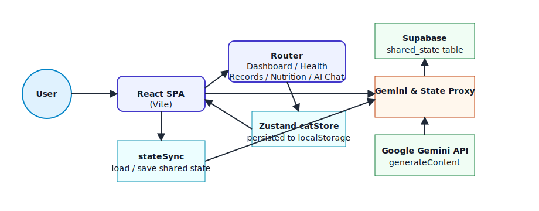

# YOU CAT DO IT Architecture Diagram

## High-level system



```mermaid
flowchart LR
  User((User))
  Browser[[React SPA (Vite)]]
  Routes["Router: Dashboard / Health Records / Nutrition / AI Chat"]
  CatStore["Zustand catStore (persist to localStorage)"]
  StateSync["stateSync service\n(load/save shared state)"]
  Proxy[[Gemini & State Proxy]]
  GeminiAPI[(Google Gemini API)]
  Supabase[(Supabase shared_state table)]

  User --> Browser
  Browser --> Routes
  Routes --> CatStore
  CatStore --> Browser
  Browser --> StateSync
  StateSync -->|/api/state GET/POST| Proxy
  Proxy -->|read/write| Supabase
  Browser -->|/api/gemini POST| Proxy
  Proxy -->|generateContent| GeminiAPI
```

## Frontend data flow


```mermaid
flowchart TB
  App[App.tsx]
  i18n[I18n language toggle]
  Pages[Dashboard / HealthRecords / NutritionTracker / AIChat]
  CatStore[catStore (cats, selectedCat)]
  LocalStorage[(LocalStorage)]
  StateSync[stateSync collect/save shared data]
  SharedState[/Shared state JSON/]

  App --> i18n
  App --> Pages
  App --> CatStore
  CatStore <--> LocalStorage
  Pages --> CatStore
  Pages --> StateSync
  StateSync --> LocalStorage
  StateSync -->|saveSharedState| SharedState
  SharedState -->|loadSharedState| StateSync
```

## Notes
- The frontend routes render dashboard, health record, nutrition, and AI chat experiences while keeping the selected cat and cat list in a persisted Zustand store.
- `stateSync` mirrors locally persisted health logs, nutrition goals, chat history, and cat storage to the `/api/state` endpoint when a proxy URL is configured.
- The Gemini proxy accepts prompts from the AI chat page and forwards them to the Google Gemini `generateContent` API, keeping secrets server-side.
